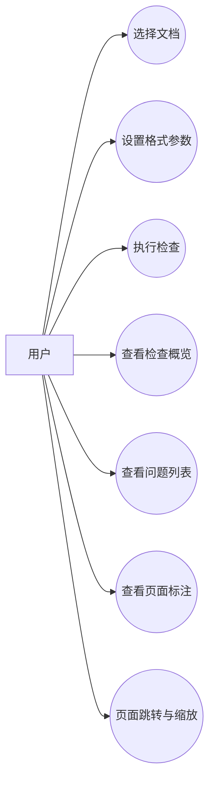
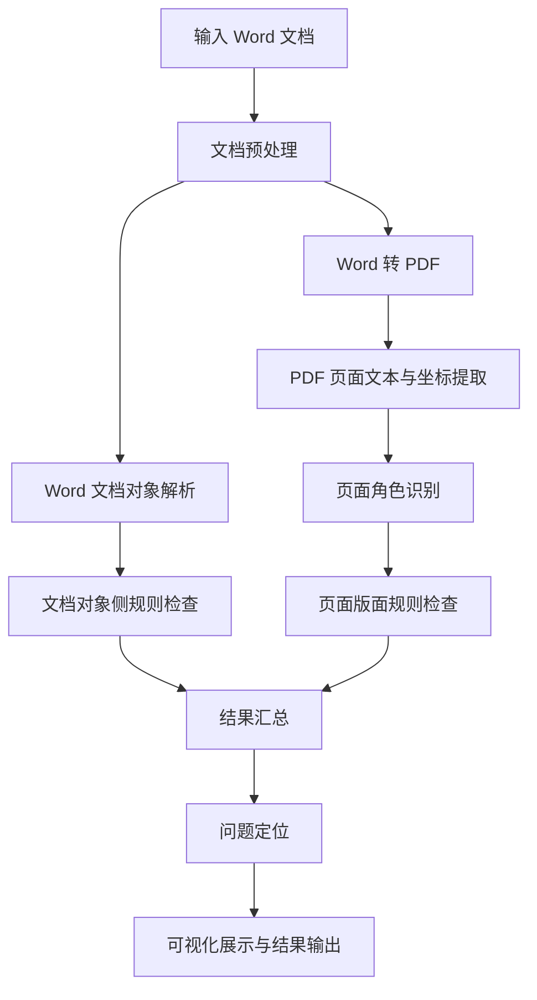
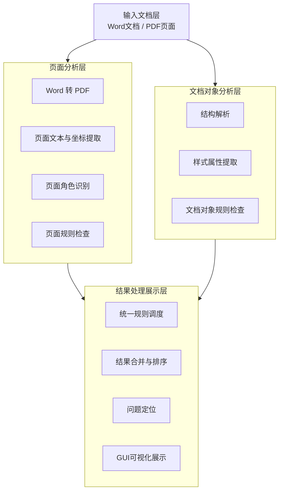
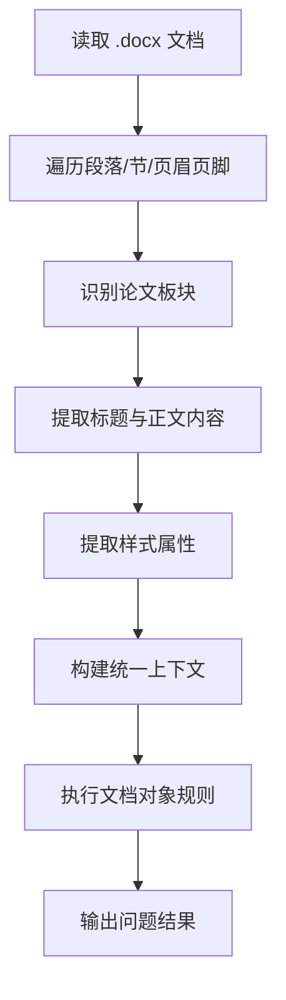
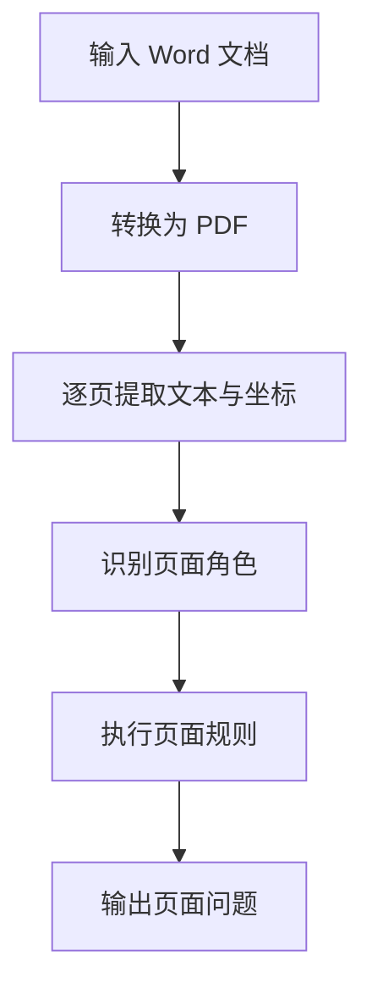
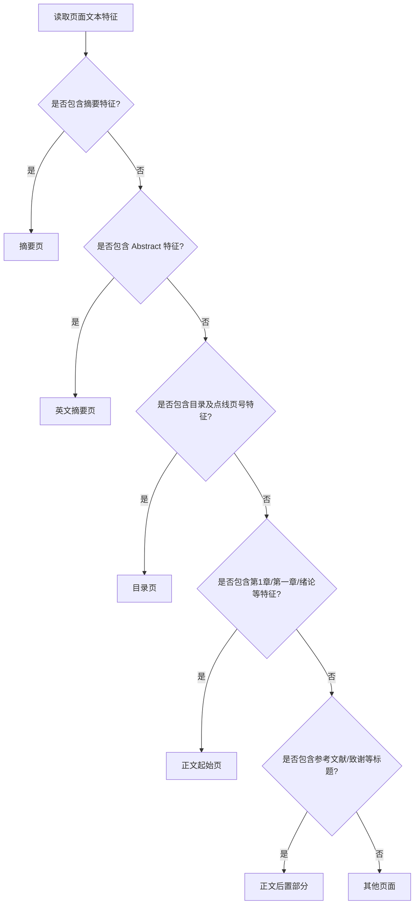
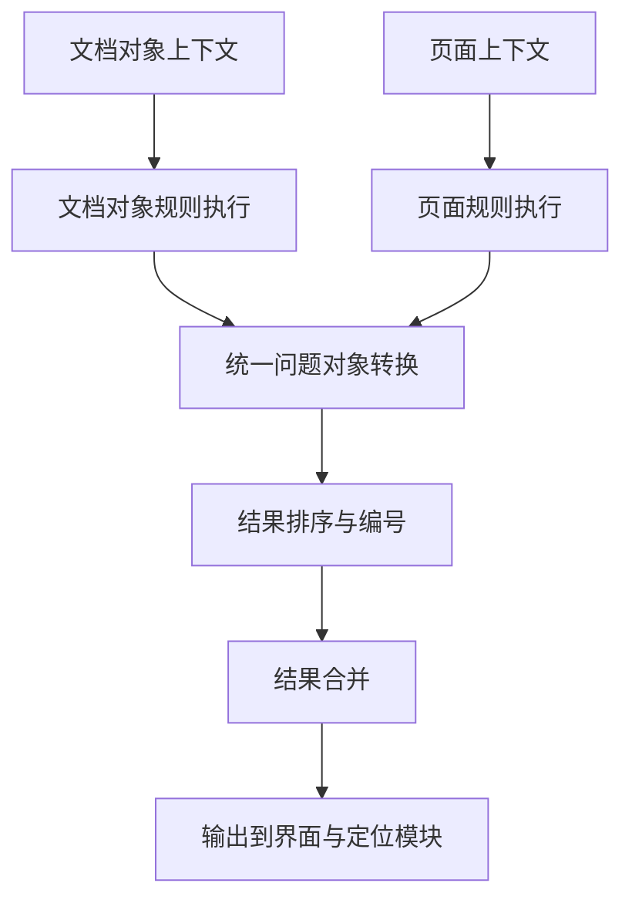
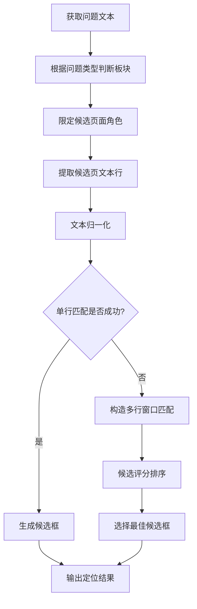
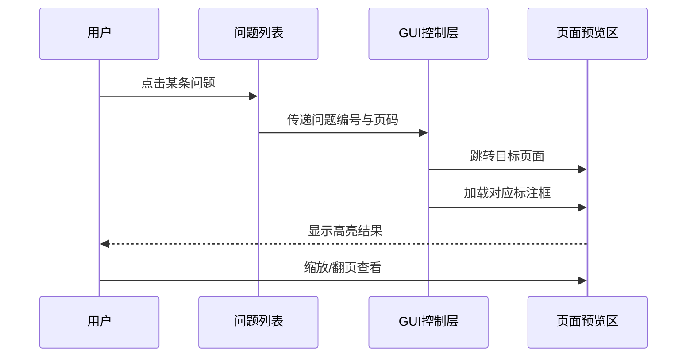

## 摘要

毕业论文格式检查是论文写作过程中的重要环节，但传统人工校对方式存在工作量大、效率低和易遗漏问题等不足。针对这一问题，本文设计并实现了一个基于 Python 的 Word 文档格式检查系统，用于辅助用户发现毕业论文中的常见格式错误。系统整体上以页面表示分析为主线，强调对文档最终版面效果的自动识别与检查。

本文首先结合毕业论文撰写规范，对论文中的格式规则进行分析，并将其划分为页面版面类规则和文档对象属性类规则两类。系统以 Word 转 PDF 后的页面文本与坐标分析为核心，对页码、页眉、章节分页、图题表题位置和公式编号位置等版面问题进行判断；同时结合 Word 文档对象解析技术，对摘要、关键词、目录、标题、引文、参考文献以及字体、字号、对齐方式和行距等内容进行辅助检查。在此基础上，系统实现了统一规则调度、结果合并、问题定位和图形界面展示功能，使用户能够在查看问题描述的同时观察问题在页面中的大致位置。

测试结果表明，本文实现的系统能够较好地完成毕业论文中多数常见格式问题的自动检查，尤其在文档结构检查、样式属性检查、页码页眉检查和结果可视化展示方面具有较好的实用效果。同时，系统在目录页数字识别、复杂页脚结构处理和文档对象问题精确定位等方面仍存在一定不足，后续仍有进一步优化空间。

总体来看，本文完成了一个面向毕业论文格式检查场景、以页面分析为核心的原型系统实现，为毕业论文排版规范化提供了一种具有实际应用价值的辅助工具。

## 关键词

毕业论文；格式检查；Word 文档；页面分析；可视化定位

## Abstract

Format checking is an important part of thesis writing, but traditional manual proofreading is often time-consuming, inefficient, and prone to omission. To address this problem, this paper designs and implements a Python-based Word document format checking system to assist users in identifying common formatting errors in undergraduate theses.

First, the thesis formatting rules are analyzed and divided into two categories: document object attribute rules and page layout rules. For the first category, the system uses Word document object parsing technology to check abstracts, keywords, tables of contents, headings, citations, references, as well as fonts, font sizes, alignment, and line spacing. For the second category, the system introduces a page analysis pipeline. After converting a Word document into PDF, the system extracts page text and coordinate information to analyze page numbers, headers, chapter pagination, caption positions, and formula numbering positions. On this basis, the system further implements hybrid rule scheduling, result merging, issue localization, and graphical interface presentation, enabling users to read issue descriptions and inspect their approximate positions on the page.

The test results show that the system can effectively detect most common formatting problems in undergraduate theses, especially in document structure checking, style attribute checking, page number and header checking, and visual result presentation. At the same time, there are still some limitations in directory number recognition, complex footer structure handling, and precise localization of document-object-based issues, which need further improvement.

Overall, this paper completes the implementation of a prototype system for thesis format checking and provides a practical auxiliary tool for standardizing thesis layout.

## Keywords

undergraduate thesis; format checking; Word document; page analysis; visual localization

## 第1章 绪论

### 1.1 课题研究背景

随着高校毕业设计（论文）写作逐渐全面电子化，论文排版与格式规范问题也变得越来越突出。对于本科毕业论文而言，除研究内容本身外，论文格式是否符合学校统一要求，同样是论文质量评价的重要组成部分。毕业论文通常包含封面、摘要、目录、正文、参考文献、致谢等多个部分，不同部分在字体、字号、对齐方式、行距、页眉、页码以及图表公式编号等方面均有较为明确的规范要求。如果这些内容依靠人工逐项核对，不仅工作量较大，而且容易因为疏忽而遗漏问题。

从实际写作过程来看，学生在论文撰写中经常会遇到格式设置不统一、目录与正文不一致、页码位置不正确、标题层级错误、图题表题位置不规范、参考文献编号混乱等问题。特别是在论文多次修改和反复排版后，原本已经调整好的格式可能再次发生变化，这使得后期人工校对的负担进一步增加。因此，研究一种能够自动发现论文格式问题的辅助检查系统，具有较强的现实意义。

另一方面，近年来文档处理、智能排版分析和文本信息提取技术不断发展，为论文格式自动检查提供了技术基础。利用 Word 文档对象解析技术，可以较方便地获取段落、标题、字体和样式等结构化信息；利用 PDF 页面分析技术，可以进一步获取页面中的文本位置和版面布局特征。将这两类信息结合起来，有望实现对论文结构类规则和版面类规则的联合检查，从而提高格式检查的覆盖范围和准确性。

基于上述背景，本文选择毕业论文格式自动检查作为研究对象，设计并实现一个基于 Python 的 Word 文档格式检查系统，以期在毕业论文排版规范化方面提供一种可行的辅助工具。

### 1.2 课题研究目的与意义

本课题的研究目的，是围绕毕业论文格式检查这一实际需求，设计并实现一个能够对 Word 文档进行自动分析、自动检查和结果可视化展示的软件系统。系统不仅需要对摘要、关键词、目录、标题、参考文献等内容结构和样式属性进行检查，还需要对页码、页眉、章节分页、图题表题位置和公式编号位置等版面规则进行分析，从而尽可能覆盖毕业论文中常见的格式问题。

从研究意义来看，本文首先具有较强的实际应用价值。毕业论文写作几乎是每位高校学生都必须经历的过程，而论文格式检查是一项高频且耗时的工作。若能够通过系统自动发现部分明显格式问题，就可以在一定程度上减轻人工校对压力，提高论文修改效率。与此同时，本文也具有一定的技术研究意义。论文格式检查并不是单纯的文本比对问题，而是同时涉及页面版面分析、文本位置理解、文档结构解析和结果定位展示等多个环节。本文以页面表示分析为主要切入点，并辅以 Word 对象解析完成规则补充，这对于相关文档智能处理任务也具有一定参考意义。

除此之外，本文还具有一定的工程实现意义。本文不仅关注规则本身的判断，还重视系统整体流程的搭建，包括文档输入、规则调度、结果合并、页面定位和图形化展示等内容。通过完成一个可运行的原型系统，可以更直观地验证相关技术方案的可行性。因此，本文的研究既来源于真实需求，也服务于真实需求，同时兼顾了一定的技术探索与工程实现价值。

### 1.3 国内外研究现状

近年来，随着文档数字化程度不断提高，文档格式自动检查逐渐成为文档处理与智能审校领域的重要研究方向。现有相关研究主要集中在文档版面分析、文档结构理解、文档要素检测与自动审校等方面。

在面向文档版面分析与文档理解的研究中，国内学者已开展了较为系统的探索。叶栩见[1]针对文档版面分析中的边缘信息利用不足和多模态协同问题，提出了基于边缘信息引导与可变形注意力的物理布局分析方法，并设计了基于多模态协同的逻辑结构提取方法，为文档结构化理解和版面要素识别提供了新的思路。赵钰豪等[2]系统回顾了文档解析技术从传统规则方法到深度学习方法的发展过程，重点分析了场景文本检测、表格理解和 LayoutLM 系列多模态预训练模型，指出多模态预训练模型已成为文档解析的重要发展方向。王家宁等[3]从版面智能布局定义出发，整理归纳了当前基于深度学习的版面智能布局算法，探讨了生成式设计在版面布局中的应用趋势，为版面自动分析与生成提供了方法论支持。刘成林等[4]对文档智能分析与识别技术进行了较全面的综述，从图像预处理、版面分析到文本识别等多个环节总结了深度学习方法的研究进展，并指出了识别精度、自适应性和可解释性等方面仍存在的问题。

在具体版面分析算法方面，相关研究主要围绕检测精度、模型轻量化和复杂场景适应性展开。蔡云冰等[5]提出了面向移动端部署需求的轻量化卷积神经网络文档版面分析算法，在保证较少参数量的同时取得了较好的检测效果。张河锁[6]针对复杂多场景文档版面分析问题，构建并公开了自然拍照手写文档数据集，提出了能够处理多层级分割任务的方法，提升了复杂文档场景下的版面分析能力。蔡云冰等[7]进一步提出基于参数重分配策略的通用文档版面分析方法，通过多尺度特征提取和轻量化结构设计提高了模型的通用性与准确率。Shehzadi 等[8]提出了一种半监督文档版面分析框架 DocSemi，在仅使用少量标注数据的情况下仍能保持较高检测性能，为低资源场景下的文档分析提供了有效方案。

尹玲等[9]针对文档版面分析效率低和训练成本较高的问题，提出了基于改进 YOLOv5s 的文档图像版面分析算法，通过改进特征提取与损失函数设计提升检测效果。袁沛愉等[10]围绕多模态元素解析难题，提出了融合多尺度特征的文档版面分析方法，以增强复杂版面场景下的识别能力。Minouei 等[11]研究了将自然场景目标检测器迁移到文档版面分析任务中的可行性，验证了基于目标检测思路处理文档布局问题的潜力。马晓松[12]提出了基于多模态学习的文档版面分析框架，通过融合图像特征、布局特征和关键字特征提高复杂布局下的分析准确率。谢海龙等[13]提出了基于复合注意力机制的文档版面分析算法，通过空间注意力、可变形卷积和通道注意力的结合增强了复杂区域检测能力。Zhou 等[14]则针对像素分类方法难以保持区域连续性的问题，提出了基于位置编码和边界框规范的文档版面分析方法。

国外研究同样在文档版面分析和文档理解方面发展较快。Shehzadi 等[8]提出的半监督框架为低标注成本场景下的版面分析提供了有效思路。Minouei 等[11]验证了目标检测方法在文档版面分析任务中的适用性。Zhou 等[14]则从版面区域连续性保持的角度，对传统像素分类思路进行了改进。

在面向实际应用的文档审校与格式检测研究中，也已有部分成果。谭伯乐[15]面向公文格式审核需求，提出了基于大语言模型的文档要素检测和语法纠错方法，并结合专门数据集和训练框架实现了较完整的智能审校流程。这类研究说明，文档格式检查不仅可以停留在传统规则匹配层面，也可以与文档检测、文本理解和智能纠错等技术结合起来，形成更完整的文档智能处理系统。

总体来看，国内外研究已经为文档格式自动检查提供了较好的理论基础和技术支持，尤其是在版面分析、文档理解和文档要素检测方面取得了明显进展。然而，面向高校毕业论文这一特定场景的自动化格式检查系统仍相对较少。现有方法要么偏重底层版面分析，要么偏重通用文档理解，对于毕业论文中同时包含结构类规则、样式类规则和页面类规则的综合检查支持仍不够充分。因此，本文尝试结合 Word 文档对象分析与页面分析方法，构建一个面向毕业论文格式检查场景的辅助系统，以提高对多类型格式问题的覆盖能力和结果展示的直观性。

### 1.4 本文研究内容

围绕毕业论文格式自动检查这一目标，本文的研究内容主要集中在几个相互衔接的方面。首先，本文分析了毕业论文撰写规范中常见的格式要求，并对适合自动检查的规则进行了整理和分类，将其划分为更适合通过 Word 文档对象分析实现的规则，以及更适合通过页面版面分析实现的规则。其次，本文设计了系统总体架构和处理流程，构建了由页面分析层、文档对象分析层和结果处理展示层组成的系统结构，使页面版面分析与文档结构解析能够在同一系统中协同工作。

在功能实现方面，本文分别完成了文档对象侧规则检查和页面版面侧规则检查。前者主要针对摘要、关键词、目录、标题、引文、参考文献以及字体字号、对齐方式、行距等规则展开，后者则利用 Word 转 PDF 后的页面文本与坐标提取结果，对页码、页眉、章节另起页、图题表题位置和公式编号位置等问题进行分析。在此基础上，系统进一步实现了结果合并、问题定位和图形化展示功能，使不同来源的问题结果能够被统一组织，并在界面中以问题列表和页面标注的形式呈现。最后，本文通过样本文档和异常样例对系统进行了测试与分析，总结了当前系统的有效性、局限性和后续可改进方向。通过上述研究内容，本文完成了一个面向毕业论文格式检查场景的原型系统实现。

### 1.5 论文结构安排

本文共分为六章，各章内容安排如下。

第1章为绪论，主要介绍课题研究背景、研究目的与意义、国内外研究现状、本文研究内容以及论文整体结构安排。

第2章为相关技术与理论基础，主要介绍 Word 文档结构与格式特征、`python-docx` 文档对象解析技术、PDF 页面文本提取与坐标分析方法、文档页面版面分析相关方法以及 PyQt 图形界面开发技术。

第3章为系统需求分析与总体方案设计，主要从系统建设目标、功能需求、规则需求、总体处理流程和总体架构设计等方面，对系统进行整体分析。

第4章为系统实现与关键功能，主要介绍文档对象分析、页面分析、规则调度、问题定位和图形界面的实现思路。

第5章为系统测试与结果分析，主要介绍测试环境、测试方法、测试样本文档设计，并结合测试结果分析系统当前的优点、不足和误差来源。

第6章为结论与展望，总结全文的主要工作和研究成果，并对系统后续可优化的方向进行展望。

## 第2章 相关技术与理论基础

### 2.1 Word 文档结构与格式特征

Word 文档是当前论文写作中最常见的电子文档形式之一，其内容不仅包含普通文本，还包含段落、标题、页眉、页脚、表格、图片、公式、脚注、参考文献等多种结构元素。与纯文本文件相比，Word 文档的一个重要特点在于，它同时保存了内容信息和格式信息。例如，同一段文字不仅有文本本身，还可能关联字体、字号、加粗方式、对齐方式、行距、缩进以及所在样式等属性。

对于毕业论文而言，Word 文档中的格式特征具有较强的层次性。论文一般由封面、摘要、目录、正文、参考文献、致谢等多个部分组成，不同部分在标题形式、字体字号和排版方式上往往存在明显区别。例如，摘要标题、正文一级标题、参考文献内容和页码在字体字号要求上通常并不相同。因此，若要实现自动化格式检查，首先需要理解 Word 文档内部的结构组织方式及其格式特征。

从实现角度看，Word 文档中的论文格式问题大致可以分为两类。第一类是结构与样式属性类问题，例如标题层级是否正确、字体字号是否符合要求、参考文献编号顺序是否规范等；第二类是页面版面类问题，例如页码是否居中、页眉是否从指定位置开始、图题表题位置是否正确等。前者更适合从 Word 文档对象本身提取，后者则往往需要结合页面最终呈现结果进行分析。正因如此，本文在系统设计中既使用了 Word 对象分析，也引入了页面分析链路。

### 2.2 `python-docx` 文档对象解析技术

`python-docx` 是 Python 环境下常用的 Word 文档处理库，能够对 `.docx` 文件中的段落、样式、表格和节等对象进行读取和部分编辑。对于本文所研究的毕业论文格式检查任务而言，`python-docx` 提供了较为方便的结构化访问能力，是文档对象分析模块的重要基础。

使用 `python-docx` 时，开发者可以将 Word 文档视为由多个对象层次构成的结构。例如，文档对象包含多个段落和节对象，每个段落又包含多个 run 对象，每个 run 对象可以对应不同的字体和字号属性。通过这些对象，系统可以获取段落文本、标题样式、对齐方式、行距以及部分页眉页脚信息，从而支持摘要、关键词、目录、标题、参考文献等内容的格式检查。

不过，`python-docx` 也存在一定局限。它更适合读取文档逻辑结构和样式属性，而对于一些底层复杂内容，如页码域代码、文本框中的内容、样式继承链以及最终页面布局信息，单靠常规对象接口往往无法完整获取。因此，在本文的实现中，除直接利用 `python-docx` 提供的对象属性外，还结合底层 XML 结构对部分特殊内容进行了补充分析，以提高页码、页脚和页眉等区域信息提取的准确性。

总体来看，`python-docx` 为论文格式检查提供了良好的文档对象分析基础，尤其适合处理标题、段落、字体字号、对齐方式、引文和参考文献等结构与样式属性类规则。

### 2.3 PDF 页面文本提取与坐标分析方法

对于页码、页眉、图题表题位置和公式编号位置等版面问题，仅通过 Word 文档对象难以准确判断，因此需要引入页面层面的分析方法。本文选择将 Word 文档转换为 PDF，再从 PDF 中提取页面文本及其坐标信息，以此作为页面分析的基础。

PDF 与 Word 文档相比，更接近文档最终输出时的页面呈现形式。通过 PDF 页面文本提取，可以获得每一页的整体文本内容，以及文本块、文本行或文本 span 在页面中的边界框坐标。这些坐标信息能够反映元素在页面中的实际位置，是判断“是否位于顶部”“是否位于底端居中”“是否位于图下表上”等空间关系的重要依据。

在本文系统中，页面分析阶段主要使用两类信息。第一类是整页文本信息，主要用于页面角色识别，例如判断某一页是否为目录页、摘要页或正文页；第二类是局部文本与坐标信息，主要用于页码候选提取、页眉检测、题注定位以及问题可视化标注。通过同时使用这两类信息，系统能够兼顾整体页面识别与局部版面分析。

因此，PDF 页面文本提取与坐标分析方法是本文实现页面规则检查的重要技术基础。

### 2.4 文档页面版面分析相关方法

文档页面版面分析是指从页面角度研究文档中各类内容的分布方式、空间关系和结构区域。相较于只关注文本内容本身，版面分析更重视文本块、标题、页码、图片、表格和公式等元素在页面中的相对位置。

在论文格式检查任务中，版面分析的意义主要体现在两个方面。其一，某些规则本质上依赖空间关系，例如页码是否位于页面底端居中、图题是否位于图下方、表题是否位于表上方、公式编号是否位于公式右侧行末等。其二，页面整体结构本身也包含较强语义信息，例如目录页通常包含点线连接的目录项，正文首页通常具有“第1章”或“绪论”等起始标记，参考文献页和致谢页往往在页面顶部出现明显标题。

本文系统中的页面版面分析方法主要采用基于规则和特征匹配的思路，而不是复杂的深度学习模型。一方面，这是因为当前课题更关注具体规范场景下的可实现性；另一方面，毕业论文的页面结构通常具有较强规律性，利用文本模式、坐标区域和相对位置关系，已经能够支持多数常见版面规则检查。虽然这种方法在复杂文档场景下仍有局限，但对于当前论文格式检查任务具有较好的适用性。

### 2.5 PyQt 图形界面开发技术

为了使检查结果更直观地呈现给用户，本文采用 PyQt 构建图形用户界面。PyQt 是 Python 环境下常用的桌面界面开发工具，提供了丰富的窗口控件、布局管理机制和事件响应能力，适合实现具有一定交互复杂度的桌面应用程序。

在本系统中，PyQt 主要用于完成文档选择、规则执行和结果展示等基础交互界面构建，同时负责显示 PDF 页面图像及问题标注结果，并实现问题列表与页面跳转之间的联动。此外，系统还借助 PyQt 提供页面缩放、浏览和结果概览展示等交互能力。

引入图形界面的意义在于，论文格式检查不仅是“有没有发现问题”，还涉及“问题在哪里、是否便于确认”。如果系统只输出文字结果，用户仍需要手动翻找文档对应位置，使用体验会受到较大影响。通过 PyQt 提供的界面展示能力，本文将检查结果、问题列表和页面可视化标注整合到同一界面中，提高了系统的可用性。

### 2.6 本章小结

本章介绍了本文实现过程中所依赖的主要相关技术与理论基础，包括 Word 文档结构与格式特征、`python-docx` 文档对象解析技术、PDF 页面文本提取与坐标分析方法、文档页面版面分析相关方法以及 PyQt 图形界面开发技术。这些内容构成了论文格式检查系统的实现基础，也为后续章节展开系统分析与功能实现提供了方法支撑。

## 第3章 系统需求分析与总体方案设计

### 3.1 系统建设目标

本课题面向毕业设计（论文）格式检查场景，目标是设计并实现一个能够对 Word 文档进行自动检查的软件系统。系统应能够根据学校毕业设计（论文）撰写规范，对论文中的封面、摘要、目录、正文、图表、公式、参考文献等部分进行格式检查，并输出相应的错误提示或警告信息，辅助用户发现论文排版中存在的问题。

传统的 Word 文档格式检查大多依赖文档对象本身的结构信息，例如段落、样式、字体、字号、对齐方式等。这类方法对文本内容和样式属性类问题具有较好的检查效果，但在涉及页面布局和视觉呈现的规则时，往往存在一定局限。例如，页码是否位于页面底端居中、页眉是否从第1章开始启用、章节标题是否另起一页、图题和表题的位置是否正确等问题，仅通过文档对象属性难以准确判断。因此，本系统将页面分析作为主要检查路径，并使用文档对象分析对结构和样式规则进行补充。

结合课题要求与实际实现情况，系统建设目标可以概括为几个彼此关联的方面。首先，系统需要完成对 Word 文档主要结构内容的自动识别与解析，并在此基础上实现文档对象属性类规则的自动检查。其次，系统还应具备对页面布局类规则的检测能力，以弥补仅依赖文档对象分析时在版面判断上的不足。在结果层面，系统需要将 `.docx` 检查结果与页面分析结果统一整合，并进一步提供问题定位与可视化展示能力。通过这些目标的实现，构建一个兼顾结构信息与页面信息的毕业论文格式检查系统，提高论文格式检查的自动化程度和结果的直观性。

### 3.2 系统功能需求分析

根据毕业论文格式检查任务的特点，系统需要具备文档输入、格式检查、结果汇总和可视化展示等基本功能。结合当前系统实现情况，功能需求主要体现在文档输入与预处理、文档对象检查、页面分析检查、结果展示以及用户交互等几个方面。

#### 3.2.1 文档输入与预处理需求

系统首先应支持用户选择待检查的 Word 文档作为输入对象。由于部分页面规则无法直接依赖 Word 文档对象完成判断，因此系统还需要具备将 Word 文档转换为 PDF 页面表示的能力，或者支持用户直接选择已有的同名 PDF 文件参与页面分析。

在文档输入完成后，系统应分别完成两类预处理：一类是对 `.docx` 文档进行结构解析，提取段落、标题、样式等对象信息；另一类是对 PDF 页面进行文本与坐标提取，为后续页面规则检查和问题标注提供基础数据。

#### 3.2.2 文档对象检查需求

文档对象侧主要面向内容结构与格式属性规则。系统应能够对论文中的主要板块进行检查，包括封面、中文摘要、英文摘要、目录、正文、参考文献和致谢等部分。同时，还应能够进一步检查字体、字号、行距、对齐方式、字符间距、标题编号、关键词数量、摘要长度、参考文献编号顺序、引文上标等具体规则。

这部分功能的重点在于利用 `python-docx` 获取到的结构化信息，对论文内容本身的规范性进行判断。

#### 3.2.3 页面分析检查需求

页面分析侧主要面向页面布局与视觉呈现规则。系统应能够识别 PDF 页面中的文本块及其坐标位置，并在此基础上完成以下类型的检查：页码位置与连续性检查、页眉启用边界检查、目录页识别、章节是否另起一页、图题表题相对位置检查、公式编号位置检查以及注释位置辅助检查等。

这部分功能的重点在于结合页面中的文本分布、坐标信息和局部区域特征，对论文的版面格式进行分析。

#### 3.2.4 检查结果展示需求

系统不仅要输出检查结果，还要尽量让结果便于理解。为此，系统需要提供统一的问题列表展示能力，能够对不同来源的检查结果进行汇总，并按照一定顺序编号显示。同时，系统还应支持错误位置的页面可视化标注，使用户能够在页面图像中直接看到问题所在区域，提高结果的可读性和实用性。

#### 3.2.5 用户交互需求

在用户交互方面，系统应支持文档选择、执行检查、问题浏览、页面跳转和页面缩放等基础操作。用户点击问题列表中的某一项后，系统应能够切换到对应页面并在左侧显示相关标注，便于快速定位问题。

图3-1 系统用例图

表3-1列出了系统功能需求的主要内容，用于说明各功能模块的边界与作用。

表3-1 系统功能需求汇总表

| 功能模块 | 输入 | 主要处理 | 输出 | 用户可见结果 |
| --- | --- | --- | --- | --- |
| 文档输入模块 | `.docx` 文件、可选 PDF 文件 | 文件选择、路径校验、同名 PDF 查找 | 文档路径、PDF 路径 | 已加载待检查文档 |
| 文档对象分析模块 | `.docx` 文档对象 | 板块识别、标题提取、样式提取 | 结构化上下文数据 | 无直接界面输出 |
| 页面分析模块 | PDF 页面数据 | 文本提取、坐标提取、页面角色识别 | 页面文本与坐标集合 | 无直接界面输出 |
| 规则执行模块 | 文档上下文、页面上下文 | 执行文档对象规则与页面规则 | 问题对象集合 | 检查概览与问题列表 |
| 结果展示模块 | 问题对象集合 | 排序、编号、聚合、格式化显示 | 结果文本、标注信息 | 问题列表与统计结果 |
| 可视化定位模块 | 问题对象、PDF 页面 | 页面跳转、边框标注、联动显示 | 标注页图像 | 问题定位与页面高亮 |

### 3.3 系统规则需求分析

论文格式检查规则种类较多，不同规则适合采用的实现方式也不同。为了提高系统的可实现性和检查效果，有必要对规则进行分类分析。

#### 3.3.1 基于文档对象的规则需求

部分规则与文档对象自身的结构和样式属性关系密切，适合通过 Word 文档对象分析实现。例如，摘要字数、关键词数量、标题编号层级、标题标点、字体字号、对齐方式、行间距、参考文献编号顺序、引文上标等，都可以通过提取段落文本和样式属性完成检查。

这类规则的特点是判定依据较明确，对页面视觉布局依赖较小，因此适合作为文档对象侧规则实现。

#### 3.3.2 基于页面版面的规则需求

还有一部分规则本质上依赖页面最终呈现效果，单靠文档对象难以准确判断。例如，页码是否位于页面底端居中、页眉是否从第1章开始启用、目录页的页面特征、章节标题是否位于新页页首、图题和表题的上下位置关系、公式编号是否位于公式右侧行末等。这些规则更适合通过页面文本块、行位置、坐标范围和局部版面关系来判断。

这类规则是本系统页面分析链路的重点内容，也是体现题目中“基于图像处理”特点的关键部分。

#### 3.3.3 混合检查需求

在实际论文格式检查过程中，仅依赖单一方式难以覆盖所有规则。因此系统需要以页面版面分析为主，同时结合文档对象分析，并对两类规则结果进行统一组织。对于页面规则，可直接利用页面号和坐标框进行展示；对于文档对象侧规则，则需要通过文本匹配与页面角色限制等方式进行近似定位，以便在图形界面中实现统一标注。

因此，系统还需要具备混合规则调度、结果合并和统一输出的能力。

表3-2列出了系统中各类规则与实现方式之间的对应关系。

表3-2 规则分类与实现方式对应表

| 规则类别 | 典型规则 | 主要数据来源 | 判断依据 | 结果展示方式 |
| --- | --- | --- | --- | --- |
| 文档对象结构规则 | 摘要长度、关键词数量、目录一致性 | `.docx` 段落与板块结构 | 文本内容、板块边界、条目数量 | 问题列表文本展示 |
| 文档对象样式规则 | 字体字号、行距、对齐方式、字符间距 | `.docx` 段落、run、样式信息 | 样式属性与规范值比对 | 问题列表文本展示 |
| 页面版面规则 | 页码位置、页眉内容、章节另起页 | PDF 页面文本与坐标 | 空间位置、候选区域、页面角色 | 问题列表与页面标注 |
| 图表公式规则 | 图题表题位置、公式编号位置 | PDF 局部文本块与坐标 | 相对位置关系、局部窗口特征 | 问题列表与页面标注 |
| 混合定位规则 | 文档对象问题页面定位 | 文档对象问题文本、PDF 页面文本 | 页面角色限制、文本匹配、候选评分 | 页面跳转与辅助标注 |

### 3.4 系统总体处理流程

根据系统建设目标和功能需求，系统总体处理流程可以概括为一个连续的处理链路。用户首先选择待检查的 Word 文档，系统随后对文档进行结构解析，构建文档对象上下文；与此同时，系统会自动寻找同名 PDF，若不存在则执行 Word 转 PDF，以获得用于页面分析的页面表示。在得到 PDF 后，系统进一步提取页面文本与坐标信息，并分别执行文档对象侧规则和页面分析侧规则。两类规则产生的问题结果最终会被统一汇总、排序，并在图形界面中以检查概览、问题列表和页面标注等形式展示出来。这一流程保证了文档内容检查与页面版面检查能够在同一框架下协同工作，既保留了文档对象分析对样式信息的利用优势，又利用页面分析补足了版面类规则的检查能力。

图3-2 系统总体处理流程图

### 3.5 系统总体架构设计

结合系统处理流程，本文将系统划分为页面分析层、文档对象分析层和结果处理展示层三个部分。

#### 3.5.1 文档对象分析层

文档对象分析层主要负责对 Word 文档进行结构化解析。该层通过文档解析模块提取论文中的各类板块、标题层级、段落文本以及格式属性信息，并将其组织成可供规则调用的上下文数据。随后，系统调用文档对象侧规则完成相关检查，生成相应的问题结果。

该层主要解决内容结构和样式属性类问题，是系统的基础检查层。

#### 3.5.2 页面分析层

页面分析层主要负责对文档的页面表示进行处理。系统先将 Word 文档转换为 PDF，再从 PDF 中提取页面文本及其坐标信息。在此基础上，系统进一步进行页面角色识别，将页面划分为中文摘要、英文摘要、目录、正文、参考文献及其他后置部分等不同语义区域。随后，系统执行页面规则，对页码、页眉、章节起始、图题表题、公式编号等版面规则进行检查。

该层主要解决页面布局和视觉呈现类问题，是系统体现页面分析能力的关键部分。

#### 3.5.3 结果处理与展示层

结果处理展示层负责对文档对象侧和页面分析侧的检查结果进行统一组织。该层一方面完成规则调度与结果合并，另一方面负责图形界面中的结果展示与交互。对于页面规则输出的问题，可直接根据页码和坐标进行标注；对于文档对象规则输出的问题，则通过页面角色限制和文本匹配方式实现近似定位，从而在图形界面中进行统一展示。

该层使系统从“能检查”进一步提升到“能直观展示和辅助定位”的层次。

图3-3 系统总体架构图

表3-3说明了各层次模块之间的职责分工。

表3-3 系统层次与模块职责表

| 层次名称 | 核心模块 | 输入 | 输出 | 主要职责 |
| --- | --- | --- | --- | --- |
| 文档对象分析层 | 文档解析、样式提取、`.docx` 规则执行 | `.docx` 文件 | 结构化上下文、`.docx` 问题结果 | 完成结构识别与样式属性检查 |
| 页面分析层 | Word 转 PDF、文本坐标提取、页面角色识别、页面规则执行 | PDF 页面数据 | 页面问题结果、页码坐标信息 | 完成版面类规则检查 |
| 结果处理展示层 | 规则调度、结果合并、定位与可视化 | 多来源问题结果 | 汇总结果、标注图像、界面联动信息 | 统一组织结果并提供交互展示 |

### 3.6 本章小结

本章从系统建设目标、功能需求、规则需求、总体处理流程和总体架构设计几个方面，对论文格式检查系统进行了整体分析。可以看出，毕业论文格式检查不仅涉及文档结构和样式属性，还涉及大量页面布局相关规则，因此仅依赖文档对象分析难以满足实际检查要求。基于这一认识，本文设计了由页面分析层、文档对象分析层和结果处理展示层组成的系统总体架构，为后续系统实现与功能展开奠定了基础。

## 第4章 系统实现与关键功能

### 4.1 文档对象分析实现

系统首先对 `.docx` 文档进行结构化解析，并构建统一上下文数据。该部分主要完成板块识别、标题提取、段落整理以及样式属性读取，为摘要、关键词、标题、参考文献和字体字号等规则提供基础数据。

在实现过程中，系统将论文划分为摘要、目录、正文、参考文献和致谢等部分，并提取对应段落文本、标题层级以及页眉页脚信息。对于普通段落，系统直接使用 `python-docx` 读取字体、字号、对齐方式和段落格式；对于页码、页眉页脚等特殊内容，则结合底层 XML 补充获取样式继承与域代码信息。

这一阶段的核心作用是把原始 Word 对象转换为可复用的中间数据，从而避免各条规则重复遍历文档。摘要长度、关键词数量、标题编号和参考文献顺序等规则，都直接依赖这一上下文完成判断。

图4-1 文档对象分析模块处理流程图

表4-1列出了文档对象分析阶段构建的主要中间数据项。

表4-1 文档对象中间数据项设计表

| 数据项名称 | 来源对象 | 主要字段 | 用途 |
| --- | --- | --- | --- |
| 摘要内容对象 | 摘要段落集合 | 文本内容、段落列表 | 摘要长度与摘要样式检查 |
| 关键词对象 | 关键词段落 | 标题文本、关键词列表 | 关键词数量与格式检查 |
| 标题列表对象 | 正文章节标题 | 标题文本、层级、顺序 | 标题编号与目录一致性检查 |
| 目录项对象 | 目录段落集合 | 条目文本、页码文本 | 目录一致性检查 |
| 参考文献对象 | 参考文献段落集合 | 编号、条目文本 | 编号顺序与引文一致性检查 |
| 页眉页脚节点对象 | 节对象头脚区域 | 节索引、文本、样式信息 | 页眉页脚与页码格式检查 |

### 4.2 页面分析与角色识别实现

为解决页码、页眉、章节分页以及图题表题位置等仅依赖 Word 对象难以判断的问题，系统将 Word 文档转换为 PDF，并基于页面文本与坐标信息开展分析。与完全依赖 OCR 的方案相比，当前实现更侧重页面表示下的版面分析，以保证实现难度和检测效果之间的平衡。

页面分析阶段主要包含三个步骤：首先获得 PDF 页面表示；其次提取整页文本、文本行和坐标框；最后依据页面文本特征识别页面角色。系统重点区分中文摘要、英文摘要、目录、正文以及正文后置部分，以缩小规则搜索范围并减少误报。

在实际实现中，目录页识别结合了“目录”标题与点线页号分布，正文起始页识别结合了“第1章”“第一章”“绪论”等模式，后置部分则通过页面顶部标题识别参考文献和致谢等板块。页面角色识别结果会被页码、页眉和问题定位等多个模块共同复用。

图4-2 页面分析模块处理流程图

图4-3 页面角色识别流程图

表4-2汇总了页面规则的主要检测对象及判断依据。

表4-2 页面规则设计说明表

| 规则名称 | 检测区域 | 主要特征 | 输出信息 |
| --- | --- | --- | --- |
| 页码存在性检查 | 页面底端区域 | 数字候选、页面角色、页码形式 | 缺失或异常页码提示 |
| 页码位置检查 | 页面底端中心区域 | 横向中心偏移、纵向位置 | 页码位置异常提示 |
| 页眉内容检查 | 页面顶部区域 | 规范页眉文本、正文页范围 | 页眉缺失或内容不符提示 |
| 页眉启用边界检查 | 正文起始页前后 | 页眉首次出现位置 | 页眉提前出现或缺失提示 |
| 章节另起页检查 | 正文页首区域 | 章节标题位置、分页边界 | 新章未另起页提示 |
| 图题表题位置检查 | 图表邻近区域 | 图表与标题上下关系 | 图题表题位置异常提示 |
| 公式编号位置检查 | 公式行末区域 | 公式主体与编号的横向关系 | 公式编号位置异常提示 |

### 4.3 规则调度与典型规则实现

系统采用统一调度方式组织文档对象规则和页面规则。文档对象规则依赖 `.docx` 上下文，页面规则依赖 PDF 页面上下文，最终都输出为统一的问题对象，便于排序、编号和界面展示。

从规则类型看，文档对象侧更适合处理摘要长度、关键词数量、标题编号、引文上标、参考文献顺序以及字体字号等样式问题；页面侧更适合处理页码位置、页眉出现范围、章节另起页、图题表题位置和公式编号位置等版面问题。两类规则在数据来源和判断方式上不同，但在结果层统一汇合。

在典型实现上，摘要长度检查通过统计摘要正文字符数完成；参考文献顺序检查通过解析条目编号序列完成；页码检查通过页面底端候选数字与页面角色共同判断；图题表题和公式编号检查则利用局部文本行之间的空间关系完成。这样的实现既保留了规则可解释性，也便于后续持续优化。

图4-4 统一规则调度与结果合并流程图

### 4.4 问题定位与可视化实现

为提高结果可读性，系统将问题列表与页面标注结合起来展示。对于页面规则，系统可直接复用规则输出的页码和坐标框进行标注；对于文档对象规则，则需要通过文本匹配实现近似定位。

在定位过程中，系统先根据问题所属板块限制候选页面，再对候选页面文本进行归一化匹配；当单行匹配不足时，进一步采用多行窗口匹配。对于参考文献条目和引文标识等特殊内容，系统还设计了更有针对性的匹配策略，以提高定位成功率。

在界面实现上，左侧显示 PDF 页面及标注结果，右侧显示检查概览和问题列表。用户点击问题条目后，界面自动跳转到对应页面并高亮相关区域，从而实现问题描述与页面位置的联动。

图4-5 文档对象问题定位流程图

图4-6 可视化标注交互时序图

【图4-7 软件主界面截图（预留，建议内容为主界面整体截图。文中说明：如图4-7所示，系统界面采用左右分栏布局，右侧用于控制与结果浏览，左侧用于页面预览与标注展示。）】

【图4-8 格式设置界面截图（预留，建议内容体现页码页眉页脚、摘要、目录等设置项。文中说明：图4-8展示了系统提供的格式参数设置功能，便于用户按规范调整检查标准。）】

### 4.5 本章小结

本章对系统的主要实现过程进行了说明，包括文档对象分析、页面分析与页面角色识别、规则调度以及问题定位与可视化展示。经过这些模块的协同配合，系统形成了从文档输入、规则检查到结果展示的完整处理链路。

## 第5章 系统测试与结果分析

### 5.1 测试环境与测试方法

为了验证系统的可用性和检查效果，本文对已实现的论文格式检查系统进行了功能测试和结果分析。测试内容主要围绕文档对象侧规则、页面版面侧规则、混合结果展示与问题定位等几个方面展开。

测试环境以 Windows 平台为主，系统采用 Python 语言开发，图形界面基于 PyQt 实现，文档对象解析依赖 `python-docx`，页面分析基于 Word 转 PDF 后的页面文本与坐标提取结果完成。在测试过程中，主要以毕业论文格式样本文档及人工构造的异常样例作为测试对象，通过运行系统检查功能，观察问题输出是否符合文档实际情况，并对发现的误报和漏报进行分析。

本文系统测试主要在 Windows 平台下完成，开发语言与主要依赖库均与系统实现阶段保持一致，具体配置见表5-1。

表5-1 测试环境配置表

| 项目 | 配置内容 |
| --- | --- |
| 操作系统 | Windows 11 64位 |
| 开发语言 | Python 3.12 |
| 图形界面框架 | PyQt6 |
| 文档对象解析库 | python-docx |
| PDF处理与坐标提取 | PyMuPDF（fitz） |
| 运行与调试环境 | VS Code |
| 测试文档类型 | `.docx`论文样本、对应PDF样本、人工构造异常样本 |
| 主要测试内容 | 文档对象规则、页面规则、混合结果展示、问题定位与可视化 |

本文采用的测试方法主要包括以下三种。第一种是规则功能测试，即针对某一条或某一类规则，单独构造存在格式错误的样例，检查系统是否能够识别出对应问题。第二种是整体流程测试，即使用较完整的论文样例运行系统，观察从文档加载、规则执行到结果展示的整体过程是否顺畅。第三种是结果对照测试，即将系统输出与人工检查结果进行比较，分析系统的有效性以及当前仍存在的不足。

### 5.2 测试样本文档设计

为了保证测试结果具有一定代表性，本文在测试时使用了两类文档样本。一类是结构相对完整的论文样本文档，这类文档包含摘要、目录、正文、参考文献等典型板块，适合用于验证系统整体处理流程和多规则协同效果；另一类是人工构造的异常样本，这类样本针对某一类规则故意设置错误格式，用于验证具体规则是否能够稳定触发。

在样本文档设计中，重点关注了以下几类典型问题：摘要长度不足或超出要求、关键词数量不符合要求、标题编号层级不正确、目录项与正文标题不一致、页码位置错误、页眉启用边界错误、章节未另起页、图题表题位置错误、公式编号未位于右侧行末、参考文献编号顺序错误等。通过覆盖这些常见问题，可以较全面地反映系统在毕业论文格式检查场景中的适用性。

此外，为了验证结果定位与页面标注功能，测试文档中还特意保留了部分能够在页面上明显定位的问题，例如页码位置异常、页眉缺失、参考文献条目错误等，以便观察系统在界面中的定位效果是否合理。

表5-2列出了测试样本文档的设计思路与覆盖范围。通过同时设置完整样本和异常样本，可以分别验证系统整体流程能力与单项规则触发能力。

表5-2 测试样本文档与异常类型设计表

| 样本编号 | 样本类型 | 包含问题 | 测试目标 |
| --- | --- | --- | --- |
| S1 | 完整论文样本 | 含摘要、目录、正文、参考文献、致谢等标准板块 | 验证系统整体流程、板块识别与多规则协同效果 |
| S2 | 摘要异常样本 | 摘要长度不足、关键词数量不符合要求 | 验证摘要与关键词相关规则的识别能力 |
| S3 | 标题异常样本 | 标题编号层级错误、标题标点不规范 | 验证标题编号与标题格式规则 |
| S4 | 目录异常样本 | 目录项与正文标题不一致 | 验证目录一致性检查能力 |
| S5 | 页码页眉异常样本 | 页码位置错误、页眉提前出现或缺失 | 验证页面规则对页码页眉的识别能力 |
| S6 | 图表公式异常样本 | 图题表题位置错误、公式编号位置错误 | 验证图表与公式版面规则 |
| S7 | 参考文献异常样本 | 编号顺序错误、引文与参考文献不一致 | 验证参考文献与引文一致性规则 |

### 5.3 文档对象侧规则测试结果

从测试结果看，文档对象侧规则在内容结构类问题和样式属性类问题上表现较为稳定。对于摘要长度、关键词数量、参考文献编号顺序、引文标识、标题标点和标题层级等规则，系统能够较可靠地识别出明显不符合规范的情形。

在字体、字号、对齐方式和行距等样式检查方面，系统对中文摘要、英文摘要、目录、正文、参考文献等主要板块均具有较好的覆盖能力，并能够在结果中同时给出出错内容与错误描述。这样一来，检查结果不仅能够提示“存在问题”，还能够为用户指出问题大致所在的文本位置。

但在测试过程中也发现，文档对象侧规则对样式继承、特殊域代码以及复杂页脚内容较为敏感。例如，在页码格式检查中，若页码对象的字号或字体并非直接定义于当前节点，而是通过样式链间接继承获得，则可能引发误判。针对这一问题，系统后续补充了样式链继承处理与页码域 run 信息提取逻辑，从而降低了页码字号误报的概率。这一现象表明，文档对象规则虽然适合完成样式属性检查，但在处理 Word 底层复杂结构时仍需结合具体实现细节持续修正和完善。

文档对象侧规则在测试中的表现见表5-3。就整体情况而言，大多数规则在结构清晰、样式定义明确的样本中均能获得较好的检出效果。

表5-3 文档对象侧规则测试结果表

| 规则名称 | 测试样例数 | 正确检出数 | 典型误差说明 |
| --- | --- | --- | --- |
| 摘要长度检查 | 6 | 6 | 对明显超长或过短情况识别稳定 |
| 关键词数量检查 | 6 | 6 | 当关键词字段结构清晰时结果稳定 |
| 标题编号层级检查 | 8 | 7 | 个别复杂编号样式下存在边界误判 |
| 标题标点检查 | 6 | 6 | 对标题末尾标点识别较准确 |
| 目录一致性检查 | 5 | 4 | 当目录项与正文标题存在格式差异时可能漏报 |
| 参考文献编号顺序检查 | 6 | 6 | 对连续编号错误识别较稳定 |
| 引文与参考文献一致性检查 | 5 | 4 | 个别上标格式不规范时匹配效果下降 |
| 字体字号检查 | 10 | 9 | 样式继承或域代码场景下偶有误判 |
| 对齐方式与行距检查 | 8 | 8 | 对普通段落样式问题识别效果较好 |

### 5.4 页面分析侧规则测试结果

页面分析侧规则主要面向页码、页眉、章节分页、图题表题和公式编号等版面类问题。从测试效果看，该部分规则较好地弥补了单纯文档对象分析的不足。尤其是在页码位置、页眉内容和章节另起页等规则上，系统能够直接利用页面文本坐标进行判断，因此所得结果更接近用户最终看到的论文排版效果。

以页码检查为例，系统能够区分摘要部分与正文部分在页码形式上的差异，并进一步判断页码是否位于页面底端居中位置。在页眉检查中，系统可根据正文页顶部文本识别规范页眉是否存在，并检测页眉是否在第1章之前提前出现。在图题表题和公式编号检查中，系统也能够依据文本块之间的空间关系给出相应提示。

不过，页面分析侧规则同样存在一定局限。测试过程中曾出现将目录页中的章节号或目录项页号误识别为页面页码的情况。其根本原因在于，目录页本身包含大量数字和点线连接项，而这些数字在空间位置上与真正页码存在一定相似性。针对这一问题，系统后续对页码候选区域、候选排序方式以及目录页专用过滤条件进行了多次调整，使目录中靠右的条目页号不再轻易被识别为页面页码。经修正后，相关误报明显减少。

这说明页面规则虽然更适合处理版面类问题，但仍容易受到局部文本布局相似性的干扰，因此在实现过程中需要结合具体场景持续优化候选筛选条件。

页面分析侧规则在测试中的表现见表5-4。整体而言，页面规则对典型版面问题具有较好的检测能力，但对数字密集和局部布局相似的页面仍需进一步优化。

表5-4 页面分析侧规则测试结果表

| 规则名称 | 测试样例数 | 正确检出数 | 误报场景 |
| --- | --- | --- | --- |
| 页码存在性检查 | 8 | 7 | 目录页数字偶尔被识别为页码 |
| 页码位置检查 | 8 | 8 | 对底端居中偏移的识别较稳定 |
| 页码样式与连续性检查 | 7 | 6 | 罗马数字与阿拉伯数字混排时存在边界误差 |
| 页眉内容检查 | 6 | 6 | 正文页顶部文本识别效果较好 |
| 页眉启用边界检查 | 6 | 5 | 个别分页边界附近存在轻微误差 |
| 章节另起页检查 | 5 | 5 | 对新章起始页判断较稳定 |
| 图题表题位置检查 | 6 | 5 | 图表附近文本较密集时易受干扰 |
| 公式编号位置检查 | 5 | 4 | 公式与正文混排时存在误报可能 |

【图5-1 页面规则检测结果截图（预留，建议内容展示页码或页眉检测实例。文中说明：图5-1给出了页面规则在实际测试文档中的检测示例。）】

### 5.5 综合检查结果分析

从系统整体运行结果看，将页面分析与文档对象分析结合起来，能够比单一方式覆盖更多的格式检查需求。其中，页面分析侧规则更适合处理页码、页眉、章节分页、图题表题和公式编号等版面问题，文档对象侧规则则更擅长处理字体、字号、标题编号、引文和参考文献等结构与样式问题，两者在功能上具有较强的互补性。

在结果展示方面，系统能够将不同来源的问题统一汇总到同一结果列表中，并给出检查概览、问题条目和页面标注信息。与仅输出文字问题的方式相比，这种混合展示方式更有利于用户理解问题。例如，当用户看到“页码可能未位于页面底端居中”这类提示后，可以直接在页面预览中查看对应位置，从而快速确认问题是否成立。

同时，混合检查方式也体现出不同来源规则在精度表现上的差异性。文档对象规则通常在结构与样式属性问题上较为稳定，但在复杂底层对象场景下可能出现误报；页面规则在版面判断上更为直观，但在目录页、复杂文本块布局等场景下仍可能受到干扰。因此，当前系统更适合定位为“辅助检查工具”，其主要作用在于帮助用户快速发现高概率问题，再结合人工判断完成最终确认。

【图5-2 综合检查结果界面截图（预留，建议内容体现 `.docx` 规则与页面规则问题统一展示效果。文中说明：图5-2展示了系统对多来源问题进行统一汇总后的界面效果。）】

### 5.6 系统不足与误差分析

尽管当前系统已经能够完成较完整的毕业论文格式检查流程，但从测试结果来看，仍然存在一些不足和误差来源。首先，部分规则仍然依赖启发式判断，当面对格式较特殊或排版方式差异较大的文档时，可能出现误报或漏报，例如目录页中的数字分布、图题表题附近的复杂文本以及公式编号与正文混排等情况，都会影响页面规则的判断结果。其次，文档对象侧规则在处理 Word 底层复杂结构时仍存在一定不稳定因素，一些页码、页眉或页脚内容并不是以普通文本形式直接存在，而是通过域代码、文本框或样式继承实现，这会增加格式提取和准确判断的难度。

与此同时，文档对象问题的页面定位目前仍属于近似定位。虽然系统已经通过页面角色限制、文本归一化匹配和多行窗口搜索等方式提高了定位成功率，但当问题文本较短、重复度较高或页面内容较复杂时，定位结果仍可能不够精确。另一个较为明显的限制在于，当前系统页面分析链路主要依赖 PDF 文本与坐标提取，尚未接入真正意义上的 OCR 图像识别能力，因此在面对扫描版文档或文本提取质量较差的 PDF 时，页面分析效果仍会受到较大影响。总体来看，这些不足并不影响系统作为论文格式辅助检查工具的基本使用价值，但也说明其在规则精度、复杂对象处理和定位可靠性等方面仍具有较大的优化空间。

测试中发现的典型误报与漏报案例归纳于表5-5，这些案例反映出系统当前主要误差来源集中在复杂版式、特殊对象结构以及近似定位环节。

表5-5 典型误报与漏报案例分析表

| 案例编号 | 问题类型 | 出现原因 | 当前处理方式 | 后续改进方向 |
| --- | --- | --- | --- | --- |
| C1 | 目录页页码误报 | 目录项页号与真实页码在空间位置上相似 | 调整候选区域与目录页过滤条件 | 引入更细粒度页面角色识别与候选评分机制 |
| C2 | 页码字号误报 | 页码对象通过样式链继承字号，未直接写入当前节点 | 增加样式链继承分析与域 run 提取 | 完善底层XML解析与继承回溯逻辑 |
| C3 | 图题表题位置误报 | 图表附近文本块较多，局部空间关系复杂 | 收紧候选窗口与关键词约束 | 增强局部版面结构建模能力 |
| C4 | 引文一致性漏报 | 引文标识格式不统一，上标形式存在差异 | 对常见marker形式进行归一化 | 引入更鲁棒的引文模式识别策略 |
| C5 | 文档对象问题定位偏差 | 候选页面文本重复度较高，近似匹配精度不足 | 使用页面角色限制与多行窗口匹配 | 引入更稳定的跨行匹配与排序模型 |

### 5.7 本章小结

本章围绕系统测试环境、测试方法、样本文档设计、文档对象侧规则测试结果、页面分析侧规则测试结果以及系统整体不足进行了分析。测试结果说明，当前系统已经能够较好地完成毕业论文中的多数常见格式检查任务，尤其在文档结构检查、样式检查、页码页眉检查和问题可视化展示方面表现较为稳定。与此同时，测试过程中暴露出的误报与定位误差问题，也为后续系统优化和功能扩展提供了明确方向。

## 第6章 结论与展望

### 6.1 论文工作总结

本文围绕毕业论文格式自动检查需求，完成了一个基于 Python 的 Word 文档格式检查系统原型。围绕学校毕业设计（论文）撰写规范，系统建立了从文档输入、规则检查到结果展示的完整处理流程，并重点面向论文中常见的结构、样式和页面版面问题开展自动分析。

在研究与实现过程中，本文完成了规则需求梳理、系统架构设计、关键功能开发以及测试分析等工作。其中，系统以页面分析为主要路径，对页码、页眉、章节分页、图题表题位置和公式编号位置等问题进行判断，并结合 Word 文档对象分析补充摘要、关键词、目录、标题、参考文献和引文等结构与样式类检查。通过引入问题定位与图形界面展示功能，检查结果能够以更直观的形式反馈给用户。整体来看，本文较好地完成了课题预期目标。

### 6.2 主要成果总结

本文的主要成果体现在三个方面。其一，完成了毕业论文格式检查系统的总体设计与开发，形成了较完整的软件处理流程。其二，构建了页面分析与文档对象分析相结合的检查机制，使系统既能处理摘要、关键词、标题、引文和参考文献等结构与样式问题，也能处理页码、页眉、章节分页、图题表题位置和公式编号位置等版面问题。其三，实现了问题定位与可视化展示功能，使不同来源的检查结果能够在同一界面中统一呈现，并便于用户快速确认问题位置。

在测试与调试过程中，系统还针对页码字号识别、目录页数字误识别为页码以及检查结果展示逻辑等问题进行了持续优化，使整体稳定性得到了一定提升。由此可见，本文实现的系统已经具备较为完整的毕业论文格式辅助检查能力，能够为用户提供具有实际价值的自动化支持。

### 6.3 不足与后续展望

虽然本文已经完成了系统的主要设计与实现工作，但受时间、经验和实现条件限制，当前系统仍存在一定不足，后续仍有进一步完善的空间。当前系统中的部分规则仍采用启发式实现方式，当文档排版形式较复杂或与常规论文样式差异较大时，仍可能出现误报或漏报；后续可以结合更多样本文档，对规则条件进行进一步细化和优化，以提高系统在复杂场景下的稳定性。

与此同时，文档对象分析在处理 Word 底层复杂结构时仍存在一定局限。页码、页眉、页脚等区域可能涉及域代码、文本框和样式继承关系，这些情况会影响系统对格式属性的准确提取，后续可以进一步加强对底层 XML 结构的分析能力，从而提高规则判断的可靠性。当前页面分析链路主要依赖 PDF 文本与坐标提取，尚未真正接入 OCR 图像识别能力，因此当面对扫描版论文、文字提取质量较差的 PDF 或版式更加复杂的页面时，系统的分析能力仍然受限。后续可以考虑引入更完善的 OCR 方法或文档版面分析模型，以增强系统对复杂页面的适应能力。

此外，当前系统的问题定位仍以近似定位为主，尤其是文档对象侧问题在页面中的位置匹配还存在一定误差，后续可以从文本匹配策略、多区域候选排序以及跨页上下文分析等方面继续改进，提高问题标注的精确度。由于系统目前主要针对单一学校毕业论文规范进行实现，若后续能够将规则配置进一步参数化和模板化，则有望扩展到更多学校和更多文档规范场景中，提高系统的通用性与推广价值。总体而言，本文完成的系统已经为毕业论文格式自动检查提供了一个可运行的实现基础，未来若能在规则精度、页面识别能力、问题定位精度和规范适配范围等方面继续完善，其应用价值将进一步提升。

## 参考文献

[1] 叶栩见.基于边缘信息融合与多模态协同的文档版面分析方法[D].杭州电子科技大学,2025.

[2] 赵钰豪,张仰森.人工智能技术在文档解析中的应用综述[J].北京信息科技大学学报(自然科学版),2025,40(04):90-98.

[3] 王家宁,朱磊,张媛,等.基于深度学习的版面智能布局设计算法研究[J].印刷工业,2023(04):49-52.

[4] 刘成林,金连文,白翔,等.文档智能分析与识别前沿: 回顾与展望[J].中国图象图形学报,2023,28(08):2223-2252.

[5] 蔡云冰,杨词慧,崔国昊,等.基于轻量化卷积神经网络的文档版面分析算法[J].南昌航空大学学报(自然科学版),2024,38(03):45-52.

[6] 张河锁.复杂多场景文档版面分析方法的研究[D].华南理工大学,2022.

[7] 蔡云冰,杨词慧,崔国昊,等.基于参数重分配策略的文档版面分析方法[J].北京邮电大学学报,2025,48(02):66-72+105.

[8] Shehzadi T, Ifza I, Stricker D, et al. DocSemi: Efficient Document Layout Analysis with Guided Queries[C]. 2025 IEEE/CVF International Conference on Computer Vision Workshops (ICCVW), 2025: 7536-7546.

[9] 尹玲,李家乐,黄勃.基于改进YOLOv5s的文档图像版面分析算法[J].软件导刊,2025,24(02):146-154.

[10] 袁沛愉,陈亮,刘昌宏.融合多尺度特征的文档版面分析算法[J/OL].计算机技术与发展,1-11[2026-03-01].

[11] Minouei M, Soheili M R, Stricker D. Document Layout Analysis with an Enhanced Object Detector[C]. 2021 5th International Conference on Pattern Recognition and Image Analysis (IPRIA), Kashan, Iran, 2021: 1-5.

[12] 马晓松.基于多模态学习的文档版面分析技术研究[D].北方工业大学,2025.

[13] 谢海龙,罗玮,徐涛涛,等.基于复合注意力机制的文档版面分析算法[J].西安邮电大学学报,2025,30(03):103-110.

[14] Zhou E, Wu X, Xiao L, et al. Document Layout Analysis Via Positional Encoding[C]. 2022 IEEE International Conference on Image Processing (ICIP), Bordeaux, France, 2022: 1156-1160.

[15] 谭伯乐.基于大语言模型的文档要素检测和语法纠错研究与应用[D].广东工业大学,2025.

## 致谢

在本论文的选题、研究、实现与撰写过程中，我得到了许多老师、同学和家人的关心、帮助与支持。在论文完成之际，谨向所有给予我帮助的人表示诚挚的感谢。

首先，衷心感谢指导老师在课题研究过程中给予我的悉心指导与耐心帮助。从课题确定、思路梳理到系统实现和论文撰写，老师都提出了许多宝贵意见，使我能够不断发现问题、完善方案并顺利推进各阶段工作。老师严谨认真的治学态度和细致负责的工作作风，也使我受益良多。

其次，感谢学院各位任课老师在本科阶段给予我的培养与帮助。通过相关课程的学习，我逐步掌握了程序设计、软件开发、文档处理等方面的基础知识，为本课题的完成奠定了必要基础。

同时，感谢身边同学在课题研究和论文写作期间给予我的交流与支持。大家在学习和实践中的讨论，使我在系统设计、功能实现和论文修改过程中获得了不少启发。

最后，感谢家人在整个学习和论文完成过程中给予我的理解、鼓励与支持。正是因为有他们的陪伴与支持，我才能够更加专注地完成本次毕业设计（论文）工作。

再次向所有关心、帮助和支持过我的老师、同学和家人致以诚挚的谢意。
